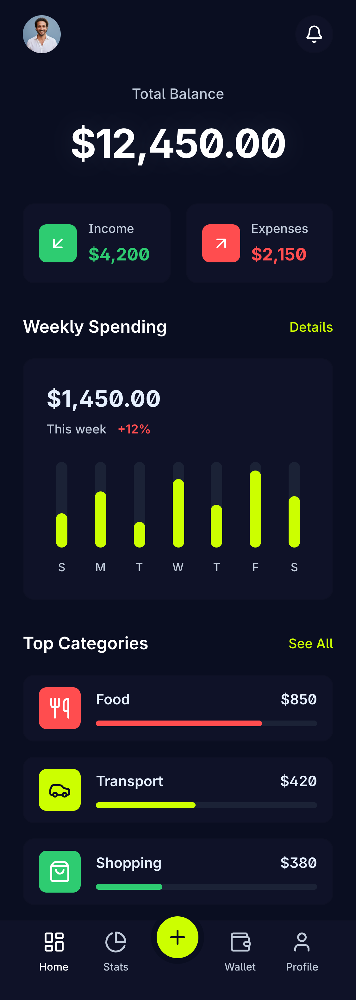

# 💰 FinanceFlow iOS

> A beautiful, feature-rich personal finance tracker built with **SwiftUI** and **modern iOS architecture**.


<p align="center">
  
  
  
</p>

---

## ✨ Features

- 📊 **Interactive Dashboard** — Real-time spending overview with Swift Charts
- 💳 **Transaction Management** — Add, categorize, and search transactions with swipe actions
- 📈 **Budget Tracking** — Set monthly budgets with visual progress indicators
- 🏷️ **Smart Categories** — AI-powered transaction categorization
- 🔔 **Budget Alerts** — Push notifications when approaching spending limits
- 🌙 **Dark Mode** — Beautiful adaptive UI with full dark mode support
- 📱 **Widgets** — Home screen widgets for quick balance overview
- 🔐 **Biometric Auth** — Face ID / Touch ID for secure access
- 📤 **Export** — Export transactions as CSV/PDF
- 🌍 **Multi-Currency** — Support for 50+ currencies with live exchange rates

---

## 🏗️ Architecture

This app follows **MVVM+C (Model-View-ViewModel + Coordinator)** architecture with strict separation of concerns:

```
FinanceFlow/
├── Sources/
│   ├── App/
│   │   └── FinanceFlowApp.swift          # App entry point
│   ├── Models/
│   │   ├── Transaction.swift             # Core Data entity
│   │   ├── Budget.swift                  # Budget model
│   │   ├── Category.swift                # Transaction categories
│   │   └── Currency.swift                # Currency support
│   ├── ViewModels/
│   │   ├── DashboardViewModel.swift      # Dashboard business logic
│   │   ├── TransactionViewModel.swift    # Transaction CRUD operations
│   │   ├── BudgetViewModel.swift         # Budget management
│   │   └── SettingsViewModel.swift       # App preferences
│   ├── Views/
│   │   ├── Dashboard/
│   │   │   ├── DashboardView.swift       # Main dashboard
│   │   │   ├── SpendingChartView.swift   # Charts integration
│   │   │   └── QuickActionsView.swift    # Quick action buttons
│   │   ├── Transactions/
│   │   │   ├── TransactionListView.swift # Transaction list
│   │   │   ├── AddTransactionView.swift  # Add/edit form
│   │   │   └── TransactionRowView.swift  # List row component
│   │   ├── Budget/
│   │   │   ├── BudgetOverviewView.swift  # Budget dashboard
│   │   │   └── BudgetDetailView.swift    # Category budget detail
│   │   └── Settings/
│   │       └── SettingsView.swift        # App settings
│   ├── Services/
│   │   ├── CoreDataManager.swift         # Core Data stack
│   │   ├── CurrencyService.swift         # Exchange rate API
│   │   ├── NotificationManager.swift     # Push notifications
│   │   ├── BiometricManager.swift        # Face ID / Touch ID
│   │   └── ExportService.swift           # CSV/PDF export
│   ├── Extensions/
│   │   ├── Color+Theme.swift             # App color palette
│   │   ├── Date+Formatting.swift         # Date utilities
│   │   └── Double+Currency.swift         # Currency formatting
│   └── Utils/
│       ├── Constants.swift               # App constants
│       └── Haptics.swift                 # Haptic feedback
├── FinanceFlowTests/
│   ├── TransactionViewModelTests.swift
│   └── CurrencyServiceTests.swift
└── FinanceFlowWidgets/
    └── BalanceWidget.swift               # Home screen widget
```

### Key Design Patterns
- **Dependency Injection** via `@EnvironmentObject` and protocol-based services
- **Reactive Data Flow** with `Combine` publishers and `@Published` properties
- **Core Data** with `NSPersistentContainer` for offline-first persistence
- **Protocol-Oriented** service layer for testability

---

## 🛠️ Tech Stack

| Technology | Purpose |
|-----------|---------|
| **Swift 5.9** | Primary language |
| **SwiftUI 5** | Declarative UI framework |
| **Combine** | Reactive data binding |
| **Core Data** | Local persistence |
| **Swift Charts** | Data visualization |
| **WidgetKit** | Home screen widgets |
| **LocalAuthentication** | Biometric security |
| **UserNotifications** | Push notifications |
| **XCTest** | Unit & UI testing |

---

## 🚀 Getting Started

### Prerequisites
- Xcode 15+
- iOS 17.0+
- Swift 5.9+

### Installation
```bash
# Clone the repository
git clone https://github.com/Adonias-hibeste/swift-financeflow-ios.git

# Open in Xcode
cd swift-financeflow-ios
open FinanceFlow.xcodeproj

# Build and run (⌘ + R)
```

### TestFlight
This app is configured for TestFlight distribution. See the [deployment guide](docs/DEPLOYMENT.md) for App Store Connect setup.

---

## 🎨 Design

The UI was designed in **Figma** following Apple's Human Interface Guidelines, then implemented pixel-perfect in SwiftUI.

### Design Principles
- **Native feel** — Uses SF Symbols, system colors, and standard iOS patterns
- **Accessibility** — Full VoiceOver support, Dynamic Type, and high contrast mode
- **Animations** — Smooth, purposeful animations using `withAnimation` and `matchedGeometryEffect`

---

## 📱 Screenshots

| Dashboard | Transactions | Budget | Settings |
|-----------|-------------|--------|----------|
|  |  |  |  |

---

## 🤝 Contributing

Contributions are welcome! Please read the [contribution guidelines](CONTRIBUTING.md) before submitting a PR.

---

## 📄 License

This project is licensed under the MIT License — see the [LICENSE](LICENSE) file for details.

---

## 👨‍💻 Author

**Adonias Hibeste** — Senior Mobile Architect
- Portfolio: [adonias-portfolio.vercel.app](https://adonias-portfolio.vercel.app)
- LinkedIn: [linkedin.com/in/adonias-hibeste](https://linkedin.com/in/adonias-hibeste)
- GitHub: [@Adonias-hibeste](https://github.com/Adonias-hibeste)
