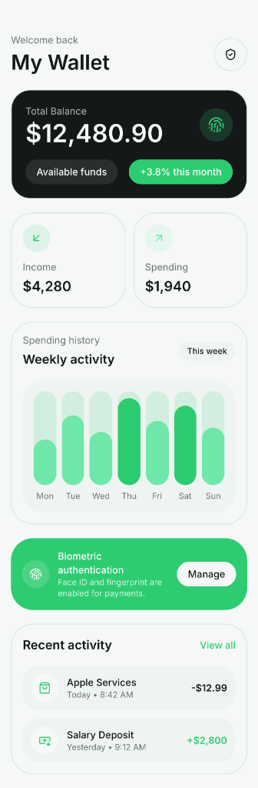
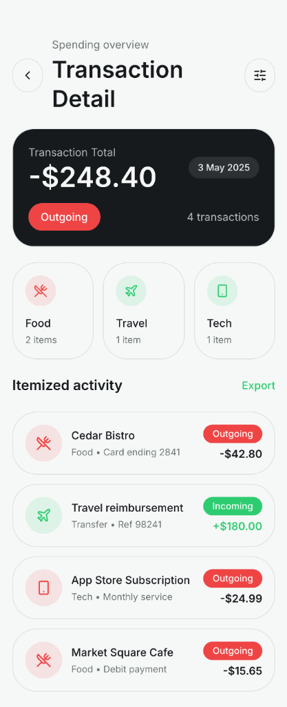

# 💰 FinanceFlow

**Intelligent Expense Tracking.**

FinanceFlow is a high-fidelity financial management application built with Flutter. It features a premium "Emerald Green" design system, interactive spending charts, biometric authentication, and a detailed transaction analytics engine designed for professional wealth management.

## 📸 Screenshots

  
  

## ✨ Features

- 💳 **Wallet Dashboard** — Real-time balance tracking with monthly growth indicators.
- 📊 **Weekly Activity** — Interactive bar charts visualizing spending patterns across the week.
- 🔒 **Biometric Security** — Integrated Face ID and Fingerprint authentication for secure financial data.
- 🔍 **Itemized Activity** — Detailed transaction breakdown with category-specific icons and status tags.
- 💎 **Premium Fintech UI** — High-contrast "Silent Luxury" aesthetic with emerald green accents.

## 🛠️ Tech Stack

- **Framework**: Flutter
- **State Management**: Riverpod / BLoC
- **Charts**: Custom Flutter Painters / FL Chart
- **Security**: Local Auth (Biometrics)
